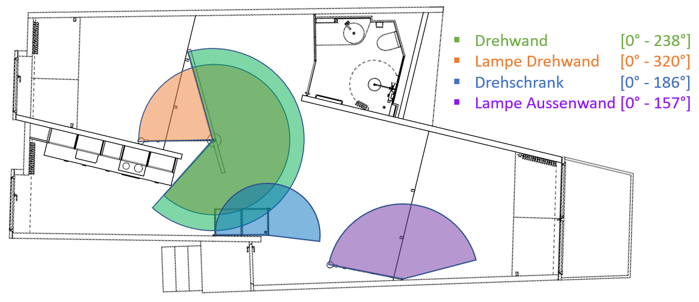

# Vacancy No-Vacancy

Authors: Roman Studer, Simon Luder, Lukas Gehrig

This thesis deals with the evaluation of sensor data collected by the ETH Zurich within the project "vacancy no-vacancy". Since the summer of 2019, the mock-up of an apartment on the roof terrace of the HIL building of the ETH Zurich has been available for one year. People from different social groups will live in the mock-up for one week each.

Four movable elements (revolving wall, revolving wall lamp, revolving cabinet, lamp outer wall) are prototypically used in the mock-up. Sensors measure the frequency of movement, the points in time and the angles selected for all movable elements. Doors and drawers are also equipped with sensors that record interaction with the elements in binary form (ON/OFF or OPEN/CLOSED). The evaluation of the collected data provides information about the dynamic interaction between people and their homes. More information about the project can be found on the ETH Zurich website.

The focus of this data analysis is on the rotating elements. These are limited by space. The starting position for each rotating element is 0°, whereby one rotation is clockwise. This allows the residents to design the room individually according to their needs.

The data analysis begins with the checking of the rotation sensor values in order to correct or ignore them if necessary. This is followed by an overview of the participants in terms of living situation, age and gender in the form of various bar plots. The first part of the actual analysis examines the number of movements of the rotary elements and other sensors. This is followed by an analysis of the simultaneous movements of the revolving wall and revolving cabinet. Last but not least, there is an analysis of the positions of the rotating elements.

The frequency and position analysis also examines behavioural differences of the mock-up residents with regard to living situation, age and gender.

## Data description PostgreSQL

`log_sensor`
- `log_sensor_id`: `int` `prinary key` Event identifier.
- `occupation_period`: `int` `foreign key` 
- `sensor`: `varchar (30)` Name of the sensor.
- `sensor_type`: `varchar (10)` ?
- `sensor_subtype`: `varchar (20)` eg. switch, contact...
- `room`: `varchar (1)` Says in which room the sensor is locatet K = Küche, W = Wohnzimmer, S = Schlafzimmer, B = Bad, H = Hauseingang.
- `sensor_state`: `numeric` For contact sensors. Contact = 1, No contact = 0.
- `sensor_numeric1`: `numeric` For rotary elements. Start angle in degrees.
- `sensor_numeric2`: `numeric` For rotary elements. Stop angle in degrees.
- `sensor_diff`: `numeric` Difference from `sensor_numeric1` to `sensor_numeric1`.
- `sensor_duration`: `numeric` Time needed to turn a rotary element in milliseconds.
- `sensor_timestamp`: `timestamp` Exact time of the event.
- `flag`: `numeric` Is one for wrong/incomplete entrys.

`occupation_period`
- `occupation_period_id`: `int` `prinary key` Occupation period identifier.
- `range`: `int` Duration of the occupation period.
- `start`: `timestamp` Start of period.
- `end`: `timestamp` End of period.

`person`
- `person_id`: `int` `prinary key` Person identifier.
- `occupation_period_id`: `int` `foreign key` 
- `age`: `varchar (5)` Age category of the person.
- `sex`: `varchar (1)` Male or Female.
- `profession`: `varchar (20)` The profession of each person.
- `employment_level`: `varchar (1)` F = fulltime, P = parttime, N = non-working.
- `origun_living_situation`: `varchar (10)` H = house, A = apartment.
- `origin_housing_space`: `numeric` Describes the number of rooms .
- `name_eth`: `numeric` Person identifier related to eth documentation.

